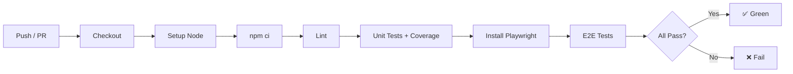
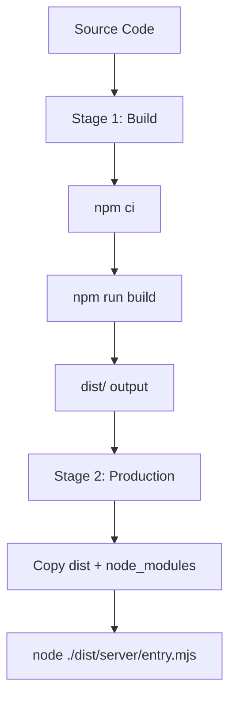

# Design: Project Scaffolding + Infrastructure

## Overview

Structural decisions for the Statli v2 project foundation. This spec is pure infrastructure — no business logic, no data model, no API endpoints. It establishes the build toolchain, testing framework, containerization, CI pipeline, and project conventions that all subsequent specs build on.

## Architecture

Single Astro application in SSR mode. Serves both the dashboard UI (pages) and API routes from a unified runtime. No separate backend process.

```
┌─────────────────────────────────────────────┐
│              Docker Container                │
│                                             │
│  ┌───────────────────────────────────────┐  │
│  │           Astro SSR App               │  │
│  │                                       │  │
│  │  ┌─────────────┐  ┌───────────────┐  │  │
│  │  │   Pages     │  │  API Routes   │  │  │
│  │  │  (UI/SSR)   │  │  (Spec 2+)    │  │  │
│  │  └─────────────┘  └───────┬───────┘  │  │
│  │                            │          │  │
│  │                   ┌────────▼────────┐ │  │
│  │                   │ Data Access     │ │  │
│  │                   │ Layer (Spec 2+) │ │  │
│  │                   └────────┬────────┘ │  │
│  │                            │          │  │
│  │                   ┌────────▼────────┐ │  │
│  │                   │    SQLite       │ │  │
│  │                   │   (Spec 2+)     │ │  │
│  │                   └─────────────────┘ │  │
│  └───────────────────────────────────────┘  │
└─────────────────────────────────────────────┘
```

## Project Structure

```
statli/
├── .github/
│   └── workflows/
│       └── ci.yml
├── .kiro/
│   ├── specs/                    # preserved from existing repo
│   └── steering/
│       ├── project-conventions.md
│       └── task-completion.md
├── src/
│   ├── pages/
│   │   └── index.astro
│   ├── layouts/
│   │   └── Layout.astro
│   └── env.d.ts
├── tests/
│   ├── unit/
│   │   └── noop.test.ts
│   └── e2e/
│       └── health.spec.ts
├── .env.example
├── .gitignore
├── .node-version
├── astro.config.ts
├── biome.json
├── CONTRIBUTING.md
├── docker-compose.yml
├── Dockerfile
├── LICENSE
├── package.json
├── playwright.config.ts
├── README.md
├── tsconfig.json
└── vitest.config.ts
```

## Key Design Decisions

### 1. Repository Reset Strategy

Normal commit that removes old Go/Wails files and adds the new TypeScript/Astro structure. Git history of the old application is preserved — this is a continuation, not a new repo.

**Approach:** Use explicit `git rm` commands targeting specific known paths (`src`, `docs`, `.vscode`, `README.md`). Never use broad removal commands (`git rm -r .`, `git rm -r *`, `git rm --cached .`). The `.kiro/` directory must remain completely untouched — verify with `git status` after removal.

### 2. Astro Configuration

```typescript
// astro.config.ts
import { defineConfig } from 'astro/config';
import node from '@astrojs/node';

export default defineConfig({
  output: 'server',
  adapter: node({
    mode: 'standalone',
  }),
});
```

- `output: 'server'` — all pages are server-rendered by default
- `@astrojs/node` adapter in `standalone` mode — produces a self-contained Node server (no external runtime needed)
- No client-side framework yet (added in Spec 4 if needed)

### 3. Biome Configuration

```json
{
  "$schema": "https://biomejs.dev/schemas/1.9.4/schema.json",
  "organizeImports": {
    "enabled": true
  },
  "linter": {
    "enabled": true,
    "rules": {
      "recommended": true,
      "style": {
        "noNonNullAssertion": "error"
      },
      "suspicious": {
        "noExplicitAny": "error"
      }
    }
  },
  "formatter": {
    "enabled": true,
    "indentStyle": "tab",
    "lineWidth": 100
  },
  "files": {
    "include": ["src/**/*.ts", "src/**/*.astro", "tests/**/*.ts"]
  }
}
```

- Single config file at project root — no ESLint, no Prettier
- Strict mode: `noNonNullAssertion` and `noExplicitAny` are errors, not warnings
- Tabs for indentation, 100-char line width
- Organize imports enabled for consistent ordering

### 4. Testing Strategy

**Vitest** for unit/integration tests:

```typescript
// vitest.config.ts
import { defineConfig } from 'vitest/config';

export default defineConfig({
  test: {
    include: ['tests/unit/**/*.test.ts'],
    coverage: {
      provider: 'v8',
      include: ['src/**/*.ts'],
      thresholds: {
        statements: 80,
        branches: 80,
        functions: 80,
        lines: 80,
      },
    },
  },
});
```

**Playwright** for end-to-end tests:

```typescript
// playwright.config.ts
import { defineConfig } from '@playwright/test';

export default defineConfig({
  testDir: './tests/e2e',
  webServer: {
    command: 'npm run dev',
    port: 4321,
    reuseExistingServer: !process.env.CI,
  },
});
```

- Coverage via `@vitest/coverage-v8` — 80% thresholds on statements, branches, functions, and lines
- Playwright targets the dev server on port 4321
- `reuseExistingServer: !process.env.CI` — reuse in dev, fresh start in CI

### 5. Docker Design

Multi-stage Dockerfile optimized for production image size:

```dockerfile
# Stage 1: Build
FROM node:22-alpine AS build
WORKDIR /app
COPY package*.json ./
RUN npm ci
COPY . .
RUN npm run build

# Stage 2: Production
FROM node:22-alpine AS production
WORKDIR /app
COPY --from=build /app/dist ./dist
COPY --from=build /app/node_modules ./node_modules
COPY --from=build /app/package.json ./package.json
ENV HOST=0.0.0.0
ENV PORT=4321
EXPOSE 4321
CMD ["node", "./dist/server/entry.mjs"]
```

```yaml
# docker-compose.yml
services:
  app:
    build: .
    ports:
      - "127.0.0.1:4321:4321"
    environment:
      - HOST=0.0.0.0
      - PORT=4321
```

- Alpine base for minimal image size
- Build stage installs all deps; production stage copies only dist + node_modules
- Bind to `127.0.0.1` on host side (security: no external exposure in dev)
- Node LTS version (22) — matches `.node-version`

### 6. CI Pipeline Design

```yaml
# .github/workflows/ci.yml
name: CI
on:
  push:
  pull_request:

jobs:
  build:
    runs-on: ubuntu-latest
    steps:
      - uses: actions/checkout@v4
      - uses: actions/setup-node@v4
        with:
          node-version-file: '.node-version'
          cache: 'npm'
      - run: npm ci
      - run: npm run lint
      - run: npm run test:coverage
      - run: npm run test:e2e:install
      - run: npm run test:e2e
```

Design principles:
- **All actions at latest major version** — validate at implementation time (no deprecated Node warnings)
- **All steps use `npm run` scripts** — local and CI use identical commands (parity)
- **`.node-version` as single source of truth** — both CI and contributors use the same Node version
- **Playwright install wrapped in npm script** (`test:e2e:install`) — keeps CI declarative
- **No matrix builds** — single Node version, single OS (ubuntu-latest)

### 7. Steering Docs Structure

Two steering files in `.kiro/steering/`:

**`project-conventions.md`** — covers:
- Technology choices (Astro SSR, TypeScript, SQLite, Biome)
- Dependency policy (pin major versions, `^` ranges OK for minor/patch)
- Code style (Biome enforced, no manual formatting)
- Architecture (single Astro app, API routes not separate backend)
- Database conventions (Spec 2+)
- Auth conventions (Spec 2+)
- CI conventions (npm scripts, latest actions, .node-version)
- Documentation as hard gate (every task must update docs)

**`task-completion.md`** — the checklist that must pass before any task is complete:
- 100% test pass
- 80% coverage minimum
- Clean commit (conventional commit format)
- Update docs (README or steering as appropriate)
- Biome passes (no lint/format errors)
- Docker build succeeds
- CI uses npm run scripts
- All GitHub Actions at latest major version

## Error Handling

Not applicable for this spec — no business logic, no runtime error paths. Error handling patterns will be established in Spec 2 (Data Model + API + Auth).

## Testing Strategy

Minimal tests to validate the infrastructure works:

- **Unit:** NoOp test (`tests/unit/noop.test.ts`) — verifies Vitest runs and coverage reporting works
- **E2E:** Health check (`tests/e2e/health.spec.ts`) — verifies Astro dev server starts and responds with 200 on `/`

## Diagrams

### CI Pipeline Flow



### Docker Build Flow


